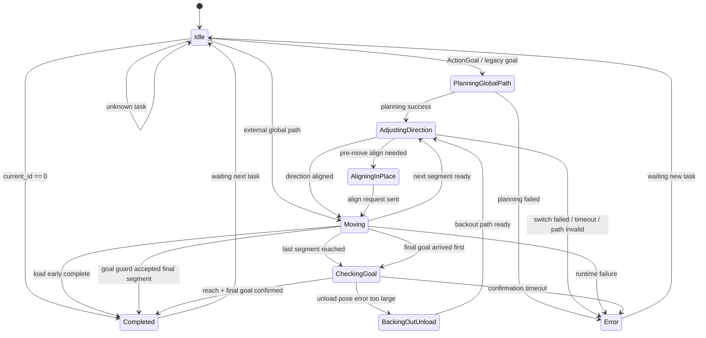

# center_articulation_planner_legacy

`center_articulation_planner_legacy` 是一个规划-控制协调状态机。它负责接收任务目标，调用远程规划器生成全局路径，将路径分段，按段切换前进/后退控制模式，发布局部路径，并在终点进行到达确认、补偿或报错。

当前状态机主逻辑位于 `src/ros/planner_ros.cpp`，状态定义位于 `include/center_articulation_planner/core/data_type.hpp`。

## 1. 状态机职责

- 接收任务入口
- 根据任务类型确定规划模式
- 调用远程规划服务生成全局路径
- 将全局路径拆分为可执行路径段
- 在每一段执行前完成方向切换
- 在运行中持续发布局部路径
- 处理段切换、终点确认、补偿退让和错误收敛

## 2. 任务入口

状态机有 3 类入口：

### 2.1 Action 入口

主入口为 `onActionGoal()`。

这是正常生产流程入口，收到任务后会：

- `reset()` 清理上一次任务缓存
- 保存 `goal/end_pose`
- 根据 `last_status/current_status` 解码任务类型
- 调用 `kickoffTaskFromAction()` 进入状态机

### 2.2 Legacy Goal 入口（仅测试）

兼容/测试入口为 `onGoal()`。

该入口会直接将收到的目标点写入 `current_goal_pose_`，并跳转到 `PlanningGlobalPath`。

### 2.3 External Global Path 入口（基本不用，待删除）

外部路径入口为 `onExternalGlobalPath()`。

该入口假设外部模块已经完成全局规划，因此会：

- 直接接收 `/global_path`
- 将其作为唯一执行段放入 `nav_path_`
- 跳过 `PlanningGlobalPath` 和 `AdjustingDirection`
- 直接进入 `Moving`

适用于“外部已经规划完成，本节点只负责执行与状态管理”的模式。

## 3. 任务类型

Action 入口中，任务类型由 `last_status/current_status` 解码得到：

| last_status | current_status | TaskType |
| --- | --- | --- |
| 2 | 0 | `InitialShovel` |  从任意点去铲料
| 1 | 0 | `NormalShovel` |   卸完料铲料
| 2 | 1 | `InitialUnload` |  从任意点去卸料
| 0 | 1 | `NormalUnload` |   铲完料卸料
| 1/0/2 | 2 | `MoveAround` | 从任意点去另一个任意点
| 其他组合 | - | `Unknown` |

其中：

- `Unknown` 不进入规划流程，而是回到 `Idle`
- `current_id == 0` 时会直接进入停车完成流程，不再进入正常规划链路

## 4. 主状态

主流程由以下 6 个状态组成：

- `Idle`
- `PlanningGlobalPath`
- `AdjustingDirection`
- `Moving`
- `CheckingGoal`
- `Completed`

这条主链路对应“正常接任务、规划、执行、确认结束”的基本过程。

## 5. 分支状态

除主链路外，状态机还有 3 个重要分支状态：

- `AligningInPlace`
  进入 `Moving` 前，如果车辆与路径首点/当前段存在较大位置或航向偏差，则先做原地对齐
- `BackingOutUnload`
  卸料任务终点姿态误差过大时，先退出再重新进入终点
- `Error`
  任意阶段出现关键失败后进入错误终止态，等待下一次新任务重新启动

## 6. 状态转移总览



说明：

- `Completed` 和 `Error` 都是“当前任务结束态”
- 二者不会自动重新发起下一轮规划，而是等待新的任务输入
- 新任务到来后会先 `reset()`，再按入口重新进入主流程

## 7. 状态说明

### 7.1 Idle

空闲态，等待新任务。

进入方式：

- 初始化默认状态
- `Unknown` 任务类型回退
- 上一个任务结束后等待下一次任务

主要动作：

- 不执行规划与控制，只保持等待

退出条件：

- 收到合法 Action 任务或 legacy goal，进入 `PlanningGlobalPath`
- 收到外部全局路径，直接进入 `Moving`
- 若 `current_id == 0`，直接进入 `Completed`

### 7.2 PlanningGlobalPath

全局规划态。

主要动作：

- 根据当前位姿和任务目标构造规划起点/终点
- 调用远程规划器服务
- 对返回路径进行分段
- 生成 `nav_path_`、方向标记和段长度信息
- 在失败时按既有 fallback 逻辑继续尝试

退出条件：

- 规划成功，进入 `AdjustingDirection`
- 规划失败且 fallback 仍失败，进入 `Error`

### 7.3 AdjustingDirection

方向调整态。

这是执行每一段路径前的准备阶段，负责让“当前车辆控制方向”与“当前路径段方向”一致。

主要动作：

- 发布当前执行段
- 根据当前段方向设置 `desired_forward_`
- 选择当前使用的位姿源
  - 前进段优先使用前车架
  - 后退段优先使用后车架
- 发布前进/后退切换命令
- 在确认切换完成后，准备进入 `Moving`

退出条件：

- 方向切换完成，进入 `Moving`
- 若进入移动前发现位置/航向偏差过大，进入 `AligningInPlace`
- 若路径无效、切换失败、反馈超时，则进入 `Error`

### 7.4 AligningInPlace

原地对齐态。

该状态是 `AdjustingDirection` 到 `Moving` 之间的补偿分支，用于降低“起步姿态不合适”导致的执行风险。

主要动作：

- 根据当前 lookahead/局部目标计算对齐角度
- 调用原地调整服务
- 准备恢复到 `Moving`

退出条件：

- 对齐请求发出后回到 `Moving`

说明：

- 这是进入 `Moving` 前的补偿分支，不改变任务目标本身
- 当前逻辑主要用于“位置偏差过大”或“航向偏差过大”的场景

### 7.5 Moving

路径执行态。

这是运行频率最高的状态，也是状态机的核心执行阶段。

主要动作：

- 高频执行 `onMovingTimer()`
- 根据当前位姿从全局段中裁剪出局部路径
- 发布局部路径给下游控制器
- 发布执行中的反馈
- 判断是否接近当前段终点或总目标终点

状态内的重要分支：

- 收到 `goal_reached`
  - 如果不是最后一段，切到下一段并回到 `AdjustingDirection`
  - 如果已经是最后一段，进入 `CheckingGoal`
- 收到 `final_goal_reached`
  - 如果此时仍在最后一段运行，进入 `CheckingGoal`
- 近终点时可能触发 `goal guard`
- 某些装载任务可能触发“提前完成”
- 运行中出现关键异常时进入 `Error`

### 7.6 CheckingGoal

终点确认态。

该状态用于等待最终到达相关信号收敛，而不是一收到单个到达信号就立即结束任务。

主要动作：

- 等待 `goal_reached`
- 等待 `final_goal_reached`
- 检查最终误差是否满足要求
- 执行超时监视

退出条件：

- 两类终点确认都满足，进入 `Completed`
- 若为卸料任务且终点姿态误差过大，进入 `BackingOutUnload`
- 若等待超时，进入 `Error`

### 7.7 BackingOutUnload

卸料终点补偿态。

该状态只在卸料类任务的终点误差不满足要求时触发。

主要动作：

- 生成“退出-重入”两段补偿路径
- 第一段先退出终点区域
- 第二段重新进入终点
- 构造完成后重新回到 `AdjustingDirection`

退出条件：

- 补偿路径生成成功，进入 `AdjustingDirection`
- 生成失败，进入 `Error`

### 7.8 Completed

任务完成态。

主要动作：

- 发布任务成功结果
- 发布停止控制相关命令
- 调用 `reset()` 清空运行缓存

说明：

- `Completed` 表示本次任务已完成
- 进入该状态后不会自动发起下一轮规划
- 后续等待新任务重新启动状态机

### 7.9 Error

错误终止态。

主要动作：

- 保存错误码与错误信息
- 发布失败结果
- 停止控制相关输出

典型触发原因：

- 规划失败
- 分段路径无效
- 换向失败或超时
- 缺少关键反馈，如距离反馈
- 终点确认超时
- 最终误差检查失败

说明：

- `Error` 不做自动恢复
- 需要依靠下一次新任务重新拉起状态机

## 8. 关键分支逻辑

### 8.1 进入 Moving 前的原地对齐

在 `AdjustingDirection` 完成后，状态机会检查当前位置和目标段之间的关系。

若发现以下情况之一：

- 位置偏差过大
- 横向偏差过大
- 航向偏差过大

则不直接进入 `Moving`，而是先进入 `AligningInPlace`。

### 8.2 非首段的大横向偏差重规划

对于非首段，状态机会在进入 `Moving` 前评估当前车辆相对剩余路径的横向偏差。

如果横向偏差过大，则可能触发“剩余路径重规划”，然后重新进入 `AdjustingDirection`。

这个分支的作用是避免车辆明显偏离剩余路径时仍强行接着跑旧轨迹。

### 8.3 Goal Guard

在接近终点时，状态机会进入一个近终点守护窗口，对“该终点是否在当前车辆姿态下可达”做额外检查。

典型用途：

- 避免在终点附近因为姿态不合理而继续硬追目标
- 对最后一段和非最后一段采取不同收敛策略

这个分支可能导致：

- 直接接受最后一段并进入 `Completed`
- 跳过当前段并回到 `AdjustingDirection`
- 或在异常情况下进入 `Error`

### 8.4 卸料终点退出-重入

对于卸料任务，如果终点姿态误差过大，状态机不会立刻判失败，而是优先尝试补偿动作：

- 退出终点区域
- 再次进入终点

这对应 `BackingOutUnload` 分支。

## 9. 一条典型主流程

以正常 Action 任务为例，状态机常见链路如下：

```text
ActionGoal
  -> PlanningGlobalPath
  -> AdjustingDirection
  -> Moving
  -> (多段时在 Moving 和 AdjustingDirection 间循环)
  -> CheckingGoal
  -> Completed
```

如果途中出现偏差或误差，还可能插入以下分支：

```text
AdjustingDirection -> AligningInPlace -> Moving
CheckingGoal -> BackingOutUnload -> AdjustingDirection -> Moving
任意状态 -> Error
```

## 10. 影响状态转移的关键参数

以下参数会显著影响状态转移行为：

- `align_pos_thresh_m`
  控制首段进入 `AligningInPlace` 的位置阈值
- `align_lateral_thresh_m`
  控制非首段进入 `AligningInPlace` 的横向偏差阈值
- `align_heading_thresh_deg`
  控制进入 `AligningInPlace` 的航向阈值
- `large_lateral_replan_thresh_m`
  控制非首段是否触发剩余路径重规划
- `max_remaining_replan_count`
  限制剩余路径重规划次数
- `goal_guard_distance_m`
  控制近终点守护窗口的触发距离
- `goal_guard_angle_deg`
  控制近终点不可达判断的角度阈值
- `backout_yaw_threshold_rad`
  控制卸料终点是否触发退出-重入补偿
- `backout_lateral_threshold_m`
  控制卸料终点横向误差补偿阈值
- `checking_goal_timeout_sec`
  控制终点确认阶段的超时时间

## 11. 阅读建议

如果要快速理解实现，建议按下面顺序阅读代码：

1. `include/center_articulation_planner/core/data_type.hpp`
2. `include/center_articulation_planner/ros/planner_ros.hpp`
3. `src/ros/planner_ros.cpp`
4. `src/ros/planner_ros_legacy.cpp`

重点关注以下函数：

- `onActionGoal()`
- `kickoffTaskFromAction()`
- `planning_global_path()`
- `adjust_vehicle_direction()`
- `finalizeDirectionSwitch()`
- `onMovingTimer()`
- `onReach()`
- `onFinalGoalReached()`
- `transitionToCompletedOrBackout()`
- `setError()`


